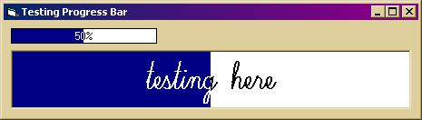



## API Detailed Progress Bar

### Description

This is basically a smooth-scrolling progress bar that is able to take a caption. I know there are loads of these already on the site, but the code is well commented, and wth anyway :)
 
### More Info
 

             |
---                |---
**Submitted On**   |2002-04-22 15:24:56
**By**             |[Eric O'Sullivan](https://github.com/Planet-Source-Code/PSCIndex/blob/master/ByAuthor/eric-o-sullivan.md)
**Level**          |Advanced
**User Rating**    |5.0 (10 globes from 2 users)
**Compatibility**  |VB 5\.0, VB 6\.0
**Category**       |[Custom Controls/ Forms/  Menus](https://github.com/Planet-Source-Code/PSCIndex/blob/master/ByCategory/custom-controls-forms-menus__1-4.md)
**World**          |[Visual Basic](https://github.com/Planet-Source-Code/PSCIndex/blob/master/ByWorld/visual-basic.md)
**Archive File**   |[API\_Detail747634232002\.zip](https://github.com/Planet-Source-Code/eric-o-sullivan-api-detailed-progress-bar__1-33937/archive/master.zip)

